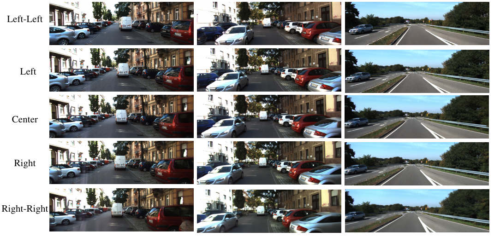

# DMS: Diffusion-Based Multi-Baseline Stereo Generation for Improving Self-Supervised Depth Estimation

[](http://www.ok.sc.e.titech.ac.jp/res/DMS/)
[](https://openaccess.thecvf.com/content/ICCV2025W/AIM/papers/Liu_DMS_Diffusion-Based_Multi-Baseline_Stereo_Generation_for_Improving_Self-Supervised_Depth_Estimation_ICCVW_2025_paper.pdf)
[](#license)
[]()
[]()

> **ICCV 2025 – AIM Workshop (Oral)**  
> DMS leverages diffusion models to synthesize **epipolar-aligned multi-baseline** views (left-shifted, right-shifted, and intermediate) that explicitly complete **occluded** and **out-of-frame** regions—boosting self-supervised depth learning without extra labels.



---

## TL;DR
- 🎯 **Goal:** Improve self-supervised stereo/mono depth in ill-posed regions.  
- 🧠 **Idea:** Fine-tune a diffusion UNet to generate novel views guided by simple **directional prompts** (“to left / to right / middle”).  
- 🚀 **Win:** Adds valid correspondences where photometric supervision was previously missing.

---

## Table of Contents
- [Installation](#installation)
- [Data Preparation](#data-preparation)
- [Pretrained Models](#pretrained-models-google-drive)
- [Train the DMB Diffusion Model](#train-the-dmb-diffusion-model)
- [Inference: Multi-Baseline Images](#inference-multi-baseline-images)
- [Citation](#citation)
- [License](#license)
- [Contact](#contact)

---

## Installation
```bash
pip install -r requirements.txt
```

---

## Data Preparation
Please download the following datasets:

- [SceneFlow](https://lmb.informatik.uni-freiburg.de/resources/datasets/SceneFlowDatasets.en.html)  
- [KITTI Raw](https://www.cvlibs.net/datasets/kitti/raw_data.php)  
- [KITTI 2012 & 2015](https://www.cvlibs.net/datasets/kitti/eval_scene_flow.php?benchmark=stereo)  
- [MPI-Sintel](http://sintel.is.tue.mpg.de/)

Set your dataset roots in the corresponding config or script files as needed.

---

## Pretrained Models (Google Drive)
- [SceneFlow-DMB](https://drive.google.com/drive/folders/1Yc2RNc8TdwPe84T5cEiYbG8QKAt1p7j-?usp=sharing)  
- [KITTI-Raw-DMB](https://drive.google.com/drive/folders/1p1vhvANOeYjGkSfc53O-EEbgKCfc3cN7?usp=sharing)  
- [KITTI-2012-DMB](https://drive.google.com/drive/folders/1wFA1QNnQie_hjf-HUnjqJhF0JrCLqBn9?usp=sharing)  
- [KITTI-2015-DMB](https://drive.google.com/drive/folders/1yw_Bcy-cLSenJtNh68Jh5HlW0kaz1ola?usp=sharing)  
- [MPI-Sintel-DMB](https://drive.google.com/drive/folders/1ewx0RNsJSjf4NXt8d9Zh9Lnv660zZPOz?usp=sharing)

---

## Train the DMB Diffusion Model

**SceneFlow**
```bash
cd scripts/SF/train
sh train_unet.sh
```

**KITTI Raw**
```bash
cd scripts/KITTI/train
sh train_kitti_raw.sh
```

**KITTI 2015**
```bash
cd scripts/KITTI/train
sh train_kitti15.sh
```

**KITTI 2012**
```bash
cd scripts/KITTI/train
sh train_kitti12.sh
```

**MPI-Sintel**
```bash
cd scripts/MPI/train
sh train_unet.sh
```

---

## Inference: Multi-Baseline Images

### SceneFlow
```bash
# left->right and right->left
cd scripts/SF/evaluation
sh evaluation.sh

# left-left and right-right
cd scripts/SF/evaluation
sh get_additional_view.sh

# middle-state views
cd scripts/SF/evaluation
sh get_middle_view.sh
```

### KITTI Raw
```bash
# left->right and right->left
cd scripts/KITTI/kitti_raw_evaluations
sh eval_unet.sh

# left-left and right-right
cd scripts/KITTI/kitti_raw_evaluations
sh unet_generated_new_view.sh

# middle-state views
cd scripts/KITTI/kitti_raw_evaluations
sh unet_generate_med_view.sh
```

### KITTI 2015
```bash
# left->right and right->left
cd scripts/KITTI/kitti2015_evaluations
sh unet_eval.sh

# left-left and right-right
cd scripts/KITTI/kitti2015_evaluations
sh get_additional_view.sh

# middle-state views
cd scripts/KITTI/kitti2015_evaluations
sh get_middle_view.sh
```

### KITTI 2012
```bash
# left->right and right->left
cd scripts/KITTI/kitti2012_evaluations
sh unet_eval.sh

# left-left and right-right
cd scripts/KITTI/kitti2012_evaluations
sh get_additional_view.sh

# middle-state views
cd scripts/KITTI/kitti2012_evaluations
sh get_middle_view.sh
```

### MPI-Sintel
```bash
# left/right + left-left/right-right
cd scripts/MPI/evaluations
sh eval_unet.sh

# middle-state views
cd scripts/MPI/evaluations
sh unet_generate_med_view.sh
```

---

## Citation
If you find this work helpful, please cite:

```bibtex
@inproceedings{liu2025dms,
  title     = {DMS: Diffusion-Based Multi-Baseline Stereo Generation for Improving Self-Supervised Depth Estimation},
  author    = {Liu, Zihua and {co-authors}},
  booktitle = {ICCV Workshops (AIM)},
  year      = {2025},
  note      = {Oral},
  url       = {http://www.ok.sc.e.titech.ac.jp/res/DMS/}
}
```

*(Replace with your final author list and add the arXiv/DOI once available.)*

---

## License
This project is released under the **MIT License**. See `LICENSE` for details.

---

## Contact
For questions, please open an issue or contact the authors via the **[project page](http://www.ok.sc.e.titech.ac.jp/res/DMS/)**.
